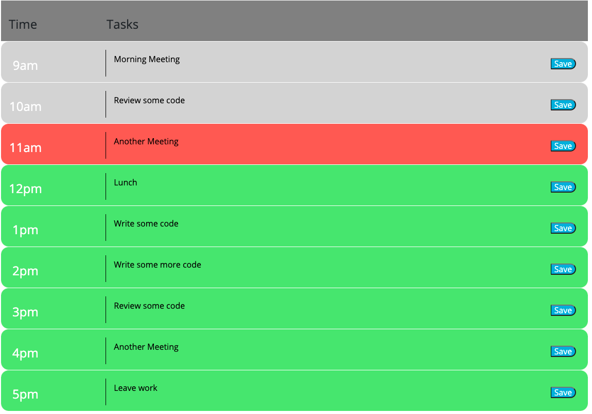

# daily-planner

## Descripton 
For this project I have created a daily work planner. The planner consists of 9 rows ranging from 9am to 5pm. Each hour block is color coded based on wether or not it is the present time, a time that has already passed, or a time in the future. Each hour block also allows you to type in and save your desired information. 
--
## Demo
 

--
## Challenges
The color coding aspect of this project took some trial and error, and resulted in a whole lot of code. With more time I would like to go back and refractor what I have to make it shorter and more concise. 
--
## Deployment Link
